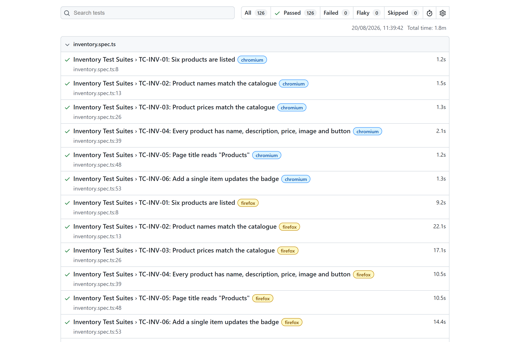

# Swag Labs — E2E Test Automation

[](https://github.com/unang09/saucelabs-playwright/actions/workflows/e2e.yml)


A Playwright + TypeScript UI suite for [Swag Labs](https://www.saucedemo.com/), a storefront that ships with six deliberately broken accounts. Every push runs the suite across Chromium, Firefox and WebKit, and publishes the HTML report.

**[▶ Latest test report](https://unang09.github.io/saucelabs-playwright/)**

[](https://unang09.github.io/saucelabs-playwright/)

## At a glance

| | |
|---|---|
| Automated cases | 42 |
| Executions per run | 126 — every case on Chromium, Firefox and WebKit |
| Full-suite runtime | ~2 min, fully parallel |
| Written test plan | [172 designed cases](resources/test-cases.md) |
| Hard waits | None — every assertion is web-first |

## Coverage

**Authentication — 23 cases.** Every account, every rejection path. Empty fields, wrong-case credentials, untrimmed whitespace, a 500-character username, SQL-injection and XSS payloads, keyboard submit, error dismissal and error recovery. `performance_glitch_user` is asserted to be *measurably* slow rather than merely reachable:

```ts
await loginPage.expectLoginSlowerThan(users.performanceGlitch, users.password, 2000);
```

**Session and access control — 13 cases.** This is the part that goes past the happy path. The app keeps no server session — authentication is a single `session-username` cookie — so the suite attacks it directly: deep links to all five protected routes while logged out, back-button replay after logout, cookie deletion mid-session, a forged cookie value, and a forged cookie for the locked-out account.

**Inventory — 6 cases.** Catalogue integrity: names and prices asserted against typed test data rather than against the DOM that produced them, structural completeness of every card, and cart-badge updates.

## Design decisions

**Locators are separated from behaviour.** Each page ships two classes — `login.locators.ts` holds nothing but lazy `Locator` getters; `login.page.ts` holds actions and assertions. A markup change touches one file and no spec.

**Fixtures construct, they never navigate.** Each page object gets a fixture, and `merge.fixture.ts` composes them with `mergeTests`, so a spec destructures only what it uses and there is no hidden navigation in a `beforeEach`:

```ts
test('TC-SES-04: Logout clears the session', async ({ loginPage, inventoryPage }) => {
```

**Sessions are seeded, not clicked.** A test option injects the session cookie before the test body, so cases that aren't *about* login skip the login UI entirely — faster, and it isolates the failure to the behaviour under test:

```ts
sessionUser: [null, { option: true }],

seedSession: [async ({ page, sessionUser }, use) => {
  if (sessionUser) {
    await page.context().addCookies([{ name: 'session-username', value: sessionUser, ... }]);
  }
  await use();
}, { auto: true }],
```

Which makes a forged-credential test three lines long:

```ts
test.describe('Forged cookie for the locked-out user', () => {
  test.use({ sessionUser: users.lockedOut });
  ...
```

**Defects are asserted, not wished away.** Several behaviours here are permanent — the demo site will not be fixed. Those cases assert the *broken* behaviour or are marked `test.fail()`, so the suite goes red if the application ever changes. Expectations are never quietly relaxed to match a bug:

```ts
// The cart is not isolated per user. This is current app behaviour, and from a
// QA perspective still a defect.
test.fail('TC-SES-07: Cart is isolated per user', async ({ loginPage, inventoryPage }) => {
```

**Test data is typed and id-aware.** Products are modelled as `{ id, name, price, slug, description }`. The id is not decoration: `problem_user` and `error_user` behave differently for odd and even ids, so the parity has to survive into the data model.

**Configuration comes from the environment.** `env.config.ts` loads `.env` and fails loudly on a missing key instead of handing `undefined` to a locator. No URLs or credentials are hard-coded in a spec.

**Cases carry their ID.** Every test is named `TC-<AREA>-<NN>`, so a case in the [test plan](resources/test-cases.md) maps to a line in the report and to `npx playwright test -g "TC-LOGIN-06"`.

## Run it

```bash
npm ci
npx playwright install
cp .env.example .env
npm test
```

`npm run test:chromium` for a single browser, `npm run test:ui` for watch mode, `npm run report` to open the last HTML report. Traces are captured on first retry.

## Layout

```
.
├── .github/workflows/e2e.yml   # cross-browser CI, report published to Pages
├── playwright.config.ts
├── resources/
│   ├── login/                  # login.page.ts  +  login.locators.ts
│   ├── inventory/
│   ├── cart/
│   ├── checkout/
│   ├── config/env.config.ts    # validated environment loading
│   ├── test-data/              # users.ts, products.ts
│   └── test-cases.md           # the written test plan
└── tests/
    ├── fixtures/               # one per page object, composed in merge.fixture.ts
    ├── login.spec.ts
    ├── session.spec.ts
    └── inventory.spec.ts
```

## Application under test

Swag Labs is a React SPA published by Sauce Labs, with no backend API — session and cart state live entirely in cookies and `localStorage`. Six accounts share the password `secret_sauce`: one baseline, one locked out, and four seeded with defects — dropped clicks and broken images (`problem_user`), a ~5 s main-thread freeze (`performance_glitch_user`), uncaught exceptions on add, sort and checkout (`error_user`), and randomised prices with layout breakage (`visual_user`).

Routes, selectors, the product catalogue and the tax rules are documented in [`resources/test-cases.md`](resources/test-cases.md), verified against the live application rather than assumed.
